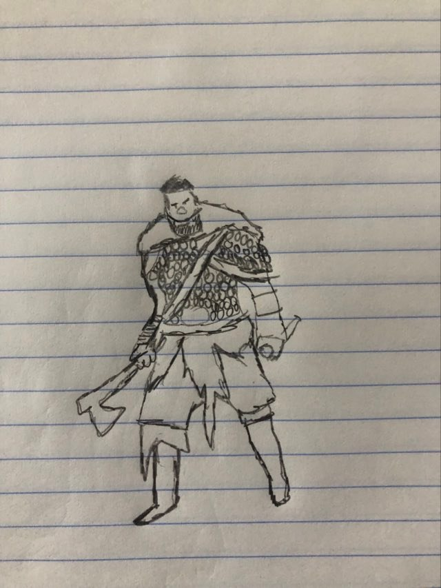

# Hello-World

# Oscar Adrian Soto Garza  100
# A01283772
# IID-5to
# H1
## H2
### H3

**bold text**
  
#Emiliano Sánchez 
**q rollo?**

# Christopher Pedraza

*italicized text*
  
> blockquote
    
1. First item
2. Second item
3. Third item

- First item
- Second item
- Third item

`code`

---

[title](https://www.example.com)



| Syntax | Description |
| ----------- | ----------- |
| Header | Title |
| Paragraph | Text |

```
{
  "firstName": "John",
  "lastName": "Smith",
  "age": 25
}
```

Here's a sentence with a footnote. [^1]

[^1]: This is the footnote.

### My Great Heading {#custom-id}
  
term
: definition

~~The world is flat.~~
  
- [x] Write the press release
- [ ] Update the website
- [ ] Contact the media


# Codigo para leer las series - 

 Input file stream - leer del in

´´´c++

   ifstream lectura;
    string linea, dato;
   
    lectura.open("Series.csv",ios::in);
    while (getline(lectura, linea))
    {
        //la linea que se leyo se muestra
        cout << linea << endl;
        stringstream registro(linea);
        
        for (int columna = 0; getline(registro, dato, ','); ++columna)
        {
            switch (columna)
            {
                case 0: // ID
                    iD = dato;
                break;
                case 1: // NOMBRE
                    titulo = dato;
                break;
                case 2: // APELLIDO
                    duracion  = std::stoi(dato);
                break;
                case 3: // EDAD
                    genero = dato;
                break;
                case 4: // PROMEDIO
                    calificacionPromedio = std::stod(dato);
                break;
                 case 5: // PROMEDIO
                    cantEpisodios = std::stoi(dato);
                break;
        }
    
    }
    cout <<iD<<","<<titulo<<","<<duracion<<","<<genero<<","<<calificacionPromedio<< "," << cantEpisodios <<"\n";

    }
    return 0;
}
´´´


